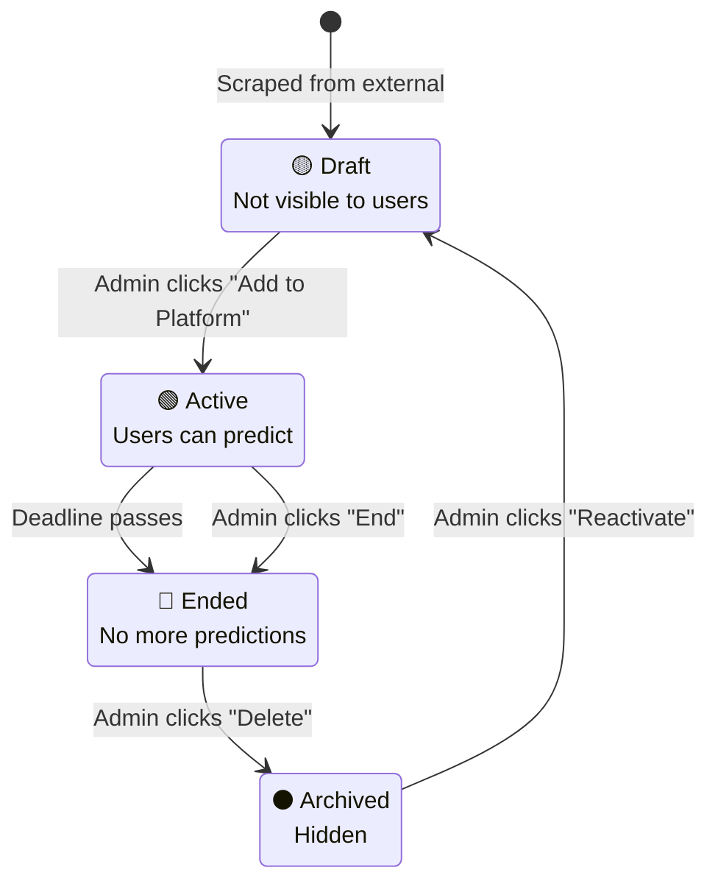

# UX Improvements Implementation Checklist

**Created:** 2026-02-27
**Based on:** [Admin Panel UX Audit](./ADMIN-PANEL-UX-AUDIT.md)
**Priority:** HIGH
**Estimated Total Time:** 2-3 weeks

---

## Priority Classification

- 🔴 **Critical** - Blocks users, causes confusion, high impact
- 🟡 **Important** - Improves experience significantly
- 🟢 **Nice to Have** - Polish, minor improvements

---

## Phase 1: Quick Wins (1-2 days)

**Goal:** Low-effort, high-impact improvements that can ship immediately

### Documentation ✅ COMPLETED

- [x] Create comprehensive UX audit report
- [x] Document isPlatformTab vs publicOnly distinction
- [x] Create admin workflow guide
- [x] Add inline comments to filter route

**Status:** ✅ All documentation completed 2026-02-27

---

### Code Comments (2 hours) 🟡

**Why:** Helps developers understand complex business logic

#### Tasks

- [x] ~~Add comments to `/api/auctions/filter` route~~ ✅ DONE
- [ ] Add JSDoc to all API route handlers
- [ ] Document query builder logic in lib/data.ts
- [ ] Add comments explaining date manipulation (subDays)
- [ ] Document state transition rules

**Example:**
```typescript
/**
 * Retrieves auctions with filtering and pagination.
 *
 * @route GET /api/auctions/filter
 * @access Admin, Public (different views)
 *
 * @queryparam {string} [search] - Keyword search (cannot combine with other filters)
 * @queryparam {string} [isPlatformTab] - "true" for admin platform view
 * @queryparam {string} [publicOnly] - "true" for public website view
 * @queryparam {number} [offset=0] - Pagination offset
 * @queryparam {number} [limit=7] - Results per page
 * @queryparam {string} [make] - Filter by make(s), use "$" delimiter
 * @queryparam {string} [sort] - Sort option (Newly Listed, Ending Soon, etc.)
 *
 * @returns {200} { total, totalPages, cars: Auction[] }
 * @returns {500} { message: string }
 *
 * @see {@link /docs/API-PARAMETER-GUIDE.md} for detailed parameter docs
 */
export async function GET(req: NextRequest) {
  // ...
}
```

**Files to update:**
- [ ] `src/app/api/auctions/route.ts`
- [ ] `src/app/api/auctions/edit/route.ts`
- [ ] `src/app/lib/data.ts`
- [ ] `src/app/models/auction.model.ts`

**Acceptance Criteria:**
- All complex business logic has explanatory comments
- All API routes have JSDoc with param/return types
- Date manipulation logic is explained

---

### Error Message Improvements (4 hours) 🔴

**Why:** Users currently get vague errors with no actionable guidance

#### Backend API Errors

**Current:**
```typescript
return NextResponse.json({ message: "Internal server error" }, { status: 500 })
```

**Better:**
```typescript
return NextResponse.json({
  error: "AUCTION_UPDATE_FAILED",
  message: "Failed to update auction",
  details: "Auction ID not found in database",
  suggestion: "Verify the auction ID is correct and try again",
  timestamp: new Date().toISOString(),
  requestId: crypto.randomUUID() // for support tracking
}, { status: 404 })
```

**Tasks:**

- [ ] Create error response utility function
- [ ] Update `/api/auctions/route.ts` error responses
- [ ] Update `/api/auctions/edit/route.ts` error responses
- [ ] Update `/api/auctions/filter/route.ts` error responses
- [ ] Add request ID tracking for debugging

**Code:**
```typescript
// src/app/lib/apiErrors.ts
export function createErrorResponse(params: {
  error: string;
  message: string;
  details?: string;
  suggestion?: string;
  status: number;
}) {
  return NextResponse.json({
    error: params.error,
    message: params.message,
    details: params.details,
    suggestion: params.suggestion,
    timestamp: new Date().toISOString(),
    requestId: crypto.randomUUID()
  }, { status: params.status })
}

// Usage:
return createErrorResponse({
  error: "AUCTION_NOT_FOUND",
  message: "Auction not found",
  details: `No auction exists with ID: ${auction_id}`,
  suggestion: "Check the auction ID and try again",
  status: 404
})
```

**Files to update:**
- [ ] Create `src/app/lib/apiErrors.ts`
- [ ] Update `src/app/api/auctions/route.ts`
- [ ] Update `src/app/api/auctions/edit/route.ts`
- [ ] Update `src/app/api/auctions/filter/route.ts`

---

#### Frontend Error Handling

**Current:**
```typescript
alert("An error occured while getting agents")
```

**Better:**
```typescript
toast.error("Failed to Load Agents", {
  description: "Could not retrieve agent predictions. Please try again.",
  action: {
    label: "Retry",
    onClick: () => handleViewRePromptAuction(auction)
  }
})
```

**Tasks:**

- [ ] Replace all `alert()` calls with toast notifications
- [ ] Add error boundary components
- [ ] Implement retry logic for failed API calls
- [ ] Add error logging (console + remote)

**Files to update:**
- [ ] `src/app/ui/dashboard/auctionsPageNew/AuctionsPage.tsx` (15 alert calls)
- [ ] All other components using `alert()`
- [ ] Add `src/app/components/ErrorBoundary.tsx`

**Acceptance Criteria:**
- Zero `alert()` calls in production code
- All user-facing errors show actionable messages
- Failed API calls can be retried
- Errors logged for debugging

---

### Tab Naming & Tooltips (1 hour) 🟡

**Why:** "External Feed" vs "Platform Auctions" confuses users

#### Tasks

- [ ] Rename "External Feed" → "Available Auctions"
- [ ] Rename "Platform Auctions" → "Active & Ended"
- [ ] Add tooltip to "Available Auctions" tab
- [ ] Add tooltip to "Active & Ended" tab
- [ ] Update copy in CardDescription

**Changes:**
```tsx
// Before:
<TabsTrigger value="external">External Feed</TabsTrigger>
<TabsTrigger value="platform">Platform Auctions</TabsTrigger>

// After:
<TabsTrigger value="external">
  <Tooltip>
    <TooltipTrigger>Available Auctions</TooltipTrigger>
    <TooltipContent>
      Auctions from external sources ready to add to your platform
    </TooltipContent>
  </Tooltip>
</TabsTrigger>

<TabsTrigger value="platform">
  <Tooltip>
    <TooltipTrigger>Active & Ended</TooltipTrigger>
    <TooltipContent>
      Auctions currently live or completed on your platform
    </TooltipContent>
  </Tooltip>
</TabsTrigger>
```

**Files to update:**
- [ ] `src/app/ui/dashboard/auctionsPageNew/AuctionsPage.tsx`
- [ ] Tab descriptions in CardHeader

**Acceptance Criteria:**
- Tab names clearly indicate purpose
- Tooltips explain what each tab shows
- No confusion about "external" meaning

---

## Phase 2: Important Improvements (3-5 days)

**Goal:** Medium-effort improvements that significantly enhance UX

### Success/Loading Feedback (8 hours) 🟡

**Why:** Users don't know if actions succeeded

#### Tasks

- [ ] Add toast notifications for all mutations
- [ ] Add success animations (checkmark, confetti)
- [ ] Implement optimistic UI updates
- [ ] Add "Last updated" timestamp
- [ ] Show inline success messages

**Implementation:**

```typescript
// Add toast library (shadcn/ui already has this)
import { toast } from '@/components/ui/toast'

async function handleStatusToggle(id: string) {
  try {
    // Optimistic update
    setActiveAuctions(prev => ({ ...prev, [id]: true }))

    await updateAuctionStatus(id, true)
    await promptAgentPredictions(id)

    // Success feedback
    toast.success("Auction Added", {
      description: "Auction is now live on your platform. AI predictions are being generated.",
      duration: 5000
    })

    // Trigger confetti animation
    confetti()

    // Auto-refresh after delay
    setTimeout(() => setRefreshToggle(prev => !prev), 2000)

  } catch (error) {
    // Revert optimistic update
    setActiveAuctions(prev => ({ ...prev, [id]: false }))

    toast.error("Failed to Add Auction", {
      description: error.message || "Please try again",
      action: {
        label: "Retry",
        onClick: () => handleStatusToggle(id)
      }
    })
  }
}
```

**Files to update:**
- [ ] `src/app/ui/dashboard/auctionsPageNew/AuctionsPage.tsx`
- [ ] Add `src/app/lib/confetti.ts` (celebration animation)
- [ ] All mutation handlers (edit, delete, reprompt)

**Acceptance Criteria:**
- All mutations show success toast
- Failed actions show error toast with retry
- Optimistic updates revert on failure
- Visual celebration on "Add to Platform"
- Data auto-refreshes after mutations

---

### Confirmation Modals (4 hours) 🟡

**Why:** Users accidentally activate wrong auctions or delete with consequences

#### Tasks

- [ ] Add confirmation for "Add to Platform"
- [ ] Improve "Delete" confirmation with warnings
- [ ] Add confirmation for "End Auction" status change
- [ ] Explain consequences in confirmation text

**Implementation:**

```tsx
<AlertDialog>
  <AlertDialogTrigger asChild>
    <Button>Add to Platform</Button>
  </AlertDialogTrigger>
  <AlertDialogContent>
    <AlertDialogHeader>
      <AlertDialogTitle>Add Auction to Platform?</AlertDialogTitle>
      <AlertDialogDescription>
        <div className="space-y-2">
          <p>This will:</p>
          <ul className="list-disc pl-5 space-y-1">
            <li>Make auction visible to all users</li>
            <li>Start generating AI predictions (~2 minutes)</li>
            <li>Allow users to place predictions</li>
          </ul>
          <p className="text-sm text-muted-foreground mt-4">
            You can deactivate it later from the Active & Ended tab.
          </p>
        </div>
      </AlertDialogDescription>
    </AlertDialogHeader>
    <AlertDialogFooter>
      <AlertDialogCancel>Cancel</AlertDialogCancel>
      <AlertDialogAction onClick={() => handleStatusToggle(auction._id)}>
        Add to Platform
      </AlertDialogAction>
    </AlertDialogFooter>
  </AlertDialogContent>
</AlertDialog>
```

**Files to update:**
- [ ] `src/app/ui/dashboard/auctionsPageNew/AuctionsPage.tsx`
- [ ] "Add to Platform" button → add confirmation
- [ ] "Delete" button → improve confirmation text
- [ ] Edit modal → confirm status changes

**Acceptance Criteria:**
- All destructive actions require confirmation
- Confirmations explain consequences clearly
- Users understand what will happen before clicking

---

### API Response Standardization (6 hours) 🟡

**Why:** Inconsistent response structures confuse developers

#### Current State

```typescript
// GET /api/auctions - uses "cars"
{ total, cars, offset, limit }

// GET /api/auctions/filter - uses "cars"
{ total, totalPages, cars }

// GET /api/tournaments/auction-filter - uses "auctions"
{ total, totalPages, auctions }
```

#### Target State

```typescript
// Standard response envelope
interface ApiResponse<T> {
  data: T;
  pagination?: {
    total: number;
    page: number;
    pageSize: number;
    totalPages: number;
  };
  metadata?: {
    requestId: string;
    timestamp: string;
    [key: string]: any;
  };
}

// Example
{
  data: [...],
  pagination: {
    total: 100,
    page: 1,
    pageSize: 10,
    totalPages: 10
  },
  metadata: {
    requestId: "abc123",
    timestamp: "2026-02-27T12:00:00Z"
  }
}
```

#### Tasks

- [ ] Create response wrapper utility
- [ ] Update `/api/auctions/route.ts` to use standard format
- [ ] Update `/api/auctions/filter/route.ts` to use standard format
- [ ] Update frontend to expect new format (with backward compat)
- [ ] Add migration guide for breaking changes

**Migration Strategy:**
```typescript
// Support both old and new formats during transition
if ('cars' in response) {
  // Old format
  data = response.cars
} else if ('data' in response) {
  // New format
  data = response.data
}
```

**Files to update:**
- [ ] Create `src/app/lib/apiResponse.ts`
- [ ] `src/app/api/auctions/route.ts`
- [ ] `src/app/api/auctions/filter/route.ts`
- [ ] `src/app/lib/data.ts` (add backward compat)

**Acceptance Criteria:**
- All endpoints return consistent structure
- Frontend handles both old/new formats
- Documentation updated with new format
- Migration path documented

---

### Type Safety Improvements (8 hours) 🟡

**Why:** `any` types and missing validation cause runtime crashes

#### Tasks

- [ ] Replace `any` types with proper interfaces
- [ ] Add Zod schemas for API responses
- [ ] Add runtime validation with Zod
- [ ] Create type-safe API client

**Implementation:**

```typescript
// src/app/lib/schemas/auction.schema.ts
import { z } from 'zod'

export const AuctionAttributeSchema = z.object({
  key: z.string(),
  value: z.union([z.string(), z.number()]),
  _id: z.string()
})

export const AuctionSchema = z.object({
  _id: z.string(),
  auction_id: z.string(),
  title: z.string(),
  image: z.string().url(),
  page_url: z.string().url(),
  isActive: z.boolean(),
  ended: z.boolean(),
  attributes: z.array(AuctionAttributeSchema).min(15),
  price: z.number().optional(),
  year: z.string().optional(),
  make: z.string().optional(),
  model: z.string().optional(),
  // ... rest of fields
})

export type Auction = z.infer<typeof AuctionSchema>

// Usage in API client
const response = await fetch('/api/auctions/filter')
const json = await response.json()

// Validate at runtime
const validated = AuctionSchema.array().safeParse(json.cars)
if (!validated.success) {
  console.error('Invalid auction data:', validated.error)
  throw new Error('Invalid auction data structure')
}

const auctions: Auction[] = validated.data
```

**Files to create:**
- [ ] `src/app/lib/schemas/auction.schema.ts`
- [ ] `src/app/lib/schemas/prediction.schema.ts`
- [ ] `src/app/lib/schemas/tournament.schema.ts`

**Files to update:**
- [ ] `src/app/lib/data.ts` - add validation
- [ ] `src/app/types/auctionTypes.ts` - derive from Zod
- [ ] All components using `any` types

**Acceptance Criteria:**
- Zero `any` types in auction-related code
- All API responses validated at runtime
- TypeScript catches type errors at compile time
- Zod errors provide clear validation messages

---

## Phase 3: Major Refactoring (5-7 days)

**Goal:** Structural improvements requiring database migrations

### ⚠️ Field Consolidation: isActive/ended → status (12 hours) 🔴

**Why:** Overlapping booleans cause confusion and bugs

**CAUTION:** This requires database migration. Coordinate with team.

#### Current Structure

```typescript
interface Auction {
  isActive: boolean;  // On platform?
  ended: boolean;     // Concluded?
  // ... confusing combinations
}
```

#### Target Structure

```typescript
interface Auction {
  status: "draft" | "scheduled" | "active" | "ended" | "archived";
  activatedAt?: Date;
  endedAt?: Date;
  // ... clear single source of truth
}
```

#### State Mapping

| Old State | New Status | Notes |
|-----------|-----------|-------|
| `isActive=false, ended=false` | `draft` | Not yet added |
| `isActive=true, ended=false` | `active` | Live on platform |
| `isActive=true, ended=true` | `ended` | Completed |
| `isActive=false, ended=true` | `archived` | Deactivated after ending |

#### Implementation Steps

**1. Add New Field (No Breaking Changes)**
- [ ] Add `status` enum to Auction model
- [ ] Add `activatedAt` and `endedAt` timestamps
- [ ] Keep old fields for backward compatibility

```typescript
// src/app/models/auction.model.ts
const auctionSchema = new Schema({
  // OLD FIELDS (keep for migration)
  isActive: { type: Boolean, default: false },
  ended: { type: Boolean, default: false },

  // NEW FIELDS
  status: {
    type: String,
    enum: ["draft", "scheduled", "active", "ended", "archived"],
    default: "draft"
  },
  activatedAt: { type: Date, required: false },
  endedAt: { type: Date, required: false },
  // ...
})
```

**2. Write Migration Script**
- [ ] Create migration to populate new fields based on old ones
- [ ] Test migration on staging database
- [ ] Run migration on production

```typescript
// scripts/migrate-auction-status.ts
import Auctions from '@/app/models/auction.model'

async function migrateAuctionStatus() {
  const auctions = await Auctions.find()

  for (const auction of auctions) {
    let status: string;

    if (!auction.isActive && !auction.ended) {
      status = "draft"
    } else if (auction.isActive && !auction.ended) {
      status = "active"
    } else if (auction.ended) {
      status = "ended"
    } else {
      status = "archived"
    }

    await Auctions.updateOne(
      { _id: auction._id },
      {
        $set: {
          status,
          activatedAt: auction.isActive ? auction.updatedAt : null,
          endedAt: auction.ended ? auction.updatedAt : null
        }
      }
    )
  }

  console.log(`Migrated ${auctions.length} auctions`)
}
```

**3. Update API Routes to Use New Field**
- [ ] Update `/api/auctions/filter` to query by `status`
- [ ] Update `/api/auctions/route` to return `status`
- [ ] Update frontend to read `status` instead of `isActive/ended`

**4. Update Frontend**
- [ ] Update UI to display status badges
- [ ] Update edit modal to use status dropdown
- [ ] Update state management logic

**5. Deprecate Old Fields**
- [ ] Mark `isActive` and `ended` as deprecated
- [ ] Add console warnings when old fields accessed
- [ ] Plan removal for next major version

**6. Remove Old Fields (Future Version)**
- [ ] Remove `isActive` and `ended` from model
- [ ] Remove from all queries
- [ ] Update documentation

**Files to update:**
- [ ] `src/app/models/auction.model.ts`
- [ ] `scripts/migrate-auction-status.ts` (new)
- [ ] `src/app/api/auctions/filter/route.ts`
- [ ] `src/app/api/auctions/route.ts`
- [ ] `src/app/api/auctions/edit/route.ts`
- [ ] `src/app/ui/dashboard/auctionsPageNew/AuctionsPage.tsx`
- [ ] `src/app/lib/data.ts`

**Acceptance Criteria:**
- All auctions have valid `status` field
- Old fields still work (backward compat)
- No data loss during migration
- Frontend displays clear status badges
- Admin can filter by status
- Documentation updated

---

### Parameter Renaming: isPlatformTab → adminViewMode (4 hours) 🟡

**Why:** Clearer naming improves developer experience

#### Current

```typescript
?isPlatformTab=true
```

#### Target

```typescript
?adminViewMode=active  // or 'pending'
```

#### Implementation

**1. Add Support for New Parameter (Backward Compatible)**

```typescript
// src/app/api/auctions/filter/route.ts
const adminViewMode = req.nextUrl.searchParams.get("adminViewMode");
const isPlatformTab = req.nextUrl.searchParams.get("isPlatformTab"); // Keep for backward compat

// Map old to new
let viewMode: "active" | "pending";
if (adminViewMode) {
  viewMode = adminViewMode === "active" ? "active" : "pending"
} else if (isPlatformTab === "true") {
  viewMode = "active"
} else {
  viewMode = "pending"
}

// Use viewMode in logic
if (viewMode === "active") {
  query = { $or: [{ isActive: true }, { ended: true }] }
} else {
  query = { /* pending logic */ }
}
```

**2. Update Frontend to Use New Parameter**

```typescript
// src/app/lib/data.ts
const data = await getCarsWithFilter({
  search: searchedKeyword,
  offset: (currentPage - 1) * 9,
  limit: displayCount,
  adminViewMode: currentTab === "platform" ? "active" : "pending",  // NEW
  // isPlatformTab: currentTab === "platform",  // DEPRECATED
});
```

**3. Add Deprecation Warning**

```typescript
if (isPlatformTab) {
  console.warn('[DEPRECATED] isPlatformTab is deprecated. Use adminViewMode instead.')
}
```

**4. Update Documentation**

- [ ] Update API docs to use new parameter
- [ ] Add migration note for developers
- [ ] Update examples

**Files to update:**
- [ ] `src/app/api/auctions/filter/route.ts`
- [ ] `src/app/lib/data.ts`
- [ ] `docs/API-PARAMETER-GUIDE.md`

**Acceptance Criteria:**
- New parameter works correctly
- Old parameter still supported (deprecated)
- Console warning shows when using old param
- Documentation reflects new parameter

---

## Phase 4: Documentation & Polish (2-3 days)

**Goal:** Complete documentation, diagrams, and final polish

### OpenAPI Specification (8 hours) 🟢

**Why:** Auto-generated docs improve developer onboarding

#### Tasks

- [ ] Install Swagger/OpenAPI tools
- [ ] Define schemas for all models
- [ ] Document all auction endpoints
- [ ] Document all tournament endpoints
- [ ] Add request/response examples
- [ ] Add authentication docs
- [ ] Deploy interactive docs at /api-docs

**Implementation:**

```yaml
# openapi.yaml
openapi: 3.0.0
info:
  title: Hammershift Admin API
  version: 1.0.0
  description: Admin panel API for managing auctions, tournaments, and users

paths:
  /api/auctions/filter:
    get:
      summary: Filter and retrieve auctions
      tags: [Auctions]
      parameters:
        - name: search
          in: query
          schema:
            type: string
          description: Keyword search (make, model, year)
        - name: adminViewMode
          in: query
          schema:
            type: string
            enum: [active, pending]
          description: Admin view context
        - name: publicOnly
          in: query
          schema:
            type: boolean
          description: Filter for public website
        # ... more params
      responses:
        '200':
          description: Successful response
          content:
            application/json:
              schema:
                $ref: '#/components/schemas/AuctionListResponse'
              example:
                total: 100
                totalPages: 10
                cars: [...]
```

**Tools:**
- [ ] Install swagger-ui-react
- [ ] Install openapi-typescript
- [ ] Set up API docs route

**Files to create:**
- [ ] `openapi.yaml`
- [ ] `src/app/api-docs/page.tsx`
- [ ] `scripts/generate-types-from-openapi.ts`

**Acceptance Criteria:**
- Complete OpenAPI spec for all endpoints
- Interactive docs accessible at /api-docs
- Examples for all endpoints
- Auto-generated TypeScript types

---

### State Machine Diagrams (4 hours) 🟢

**Why:** Visual reference for auction lifecycle

#### Tasks

- [ ] Create Mermaid diagram for auction states
- [ ] Document state transitions
- [ ] Add trigger conditions
- [ ] Create visual workflow diagram

**Implementation:**

```markdown
# docs/AUCTION-LIFECYCLE.md

## Auction State Machine



## State Transition Rules

| From | To | Trigger | Validation |
|------|-----|---------|-----------|
| Draft → Active | Admin action | Deadline > now + 24h |
| Active → Ended | Auto/Manual | Deadline passed OR admin |
| Ended → Archived | Admin action | None |
| Archived → Draft | Admin action | None |

[... detailed explanation for each transition ...]
```

**Files to create:**
- [ ] `docs/AUCTION-LIFECYCLE.md`
- [ ] `docs/diagrams/auction-workflow.png`

**Acceptance Criteria:**
- Clear visual state diagram
- Documented transition rules
- Examples for each state
- Edge cases explained

---

### Developer Onboarding Guide (6 hours) 🟢

**Why:** New developers need quick start guide

#### Tasks

- [ ] Create step-by-step setup guide
- [ ] Document environment variables
- [ ] Create sample API calls
- [ ] Add troubleshooting section

**Content:**

```markdown
# Developer Onboarding Guide

## Prerequisites

- Node.js 18+
- MongoDB 6+
- Git

## Quick Start (15 minutes)

1. Clone repository
git clone https://github.com/hammershift/admin-panel.git
cd admin-panel

2. Install dependencies
npm install

3. Configure environment
cp .env.example .env.local
# Edit .env.local with your MongoDB URI

4. Run development server
npm run dev

5. Open http://localhost:3000

## Making Your First Change

### Exercise: Add a new sort option

1. Update filter route
2. Update frontend dropdown
3. Test with curl
4. Submit PR

[... detailed walkthrough ...]

## Common Pitfalls

- isPlatformTab vs publicOnly confusion → See API Parameter Guide
- Hardcoded attribute indices → Use attribute helper functions
- Missing error handling → Use error response utility

## Resources

- [API Parameter Guide](./API-PARAMETER-GUIDE.md)
- [UX Audit](./ADMIN-PANEL-UX-AUDIT.md)
- [Workflow Guide](./AUCTION-WORKFLOW-GUIDE.md)
```

**Files to create:**
- [ ] `docs/DEVELOPER-ONBOARDING.md`
- [ ] `docs/CONTRIBUTING.md`
- [ ] `docs/ARCHITECTURE.md`

**Acceptance Criteria:**
- New developer can run app in <15 min
- Guide covers common issues
- Links to all relevant docs
- Code examples work correctly

---

## Testing Plan

### Unit Tests

- [ ] Test auction status transitions
- [ ] Test filter query builder
- [ ] Test error response utility
- [ ] Test Zod schema validation

### Integration Tests

- [ ] Test auction add/edit/delete flow
- [ ] Test search with various keywords
- [ ] Test filter combinations
- [ ] Test pagination

### E2E Tests

- [ ] Admin adds auction to platform
- [ ] Admin edits auction details
- [ ] Admin views predictions
- [ ] Admin reprompts failed agents

**Tools:**
- Jest for unit tests
- Playwright for E2E tests
- MSW for API mocking

---

## Rollout Plan

### Week 1: Phase 1 (Quick Wins)
- Day 1-2: Documentation, comments, error messages
- Day 3: Tab naming, tooltips
- Deploy to staging

### Week 2: Phase 2 (Important)
- Day 1-2: Success feedback, confirmations
- Day 3-4: API standardization, type safety
- Deploy to staging, test with admins

### Week 3: Phase 3 (Major Refactoring)
- Day 1-3: Status field migration (carefully!)
- Day 4-5: Parameter renaming, testing
- Deploy to production with feature flag

### Week 4: Phase 4 (Documentation)
- Day 1-2: OpenAPI spec
- Day 3-4: Diagrams, onboarding guide
- Final review and docs deploy

---

## Success Metrics

Track these before and after implementation:

| Metric | Baseline | Target | How to Measure |
|--------|----------|--------|----------------|
| Admin task time | 5 min/auction | 2 min/auction | Time study |
| Error rate | 5% | <1% | Error tracking |
| Support tickets | 10/week | <3/week | Ticket system |
| Dev onboarding | 2 days | 4 hours | New hire survey |

---

## Risk Mitigation

### High-Risk Changes

**Database Migration (Status Field)**
- Risk: Data loss or corruption
- Mitigation: Test on staging, backup production, rollback plan

**API Breaking Changes**
- Risk: Frontend breaks
- Mitigation: Backward compatibility layer, phased rollout

### Testing Strategy

- Test each phase on staging before production
- Get admin user feedback before full rollout
- Monitor error logs closely after deployment
- Have rollback plan for each phase

---

## Questions & Clarifications

### Before Starting

- [ ] Confirm timeline with team
- [ ] Assign tasks to developers
- [ ] Schedule code review sessions
- [ ] Plan deployment windows

### During Implementation

- [ ] Weekly check-ins on progress
- [ ] Test with real admin users
- [ ] Document any blockers
- [ ] Adjust timeline if needed

---

## Appendix: File Changes Summary

**Files to Create:**
- `docs/ADMIN-PANEL-UX-AUDIT.md` ✅
- `docs/API-PARAMETER-GUIDE.md` ✅
- `docs/AUCTION-WORKFLOW-GUIDE.md` ✅
- `docs/UX-IMPROVEMENTS-CHECKLIST.md` ✅
- `docs/AUCTION-LIFECYCLE.md`
- `docs/DEVELOPER-ONBOARDING.md`
- `src/app/lib/apiErrors.ts`
- `src/app/lib/apiResponse.ts`
- `src/app/lib/schemas/auction.schema.ts`
- `src/app/components/ErrorBoundary.tsx`
- `scripts/migrate-auction-status.ts`
- `openapi.yaml`

**Files to Update:**
- `src/app/api/auctions/route.ts`
- `src/app/api/auctions/edit/route.ts`
- `src/app/api/auctions/filter/route.ts` ✅
- `src/app/ui/dashboard/auctionsPageNew/AuctionsPage.tsx`
- `src/app/lib/data.ts`
- `src/app/models/auction.model.ts`
- `src/app/types/auctionTypes.ts`

---

**Last Updated:** 2026-02-27
**Status:** Ready for implementation
**Next Step:** Assign Phase 1 tasks to team
